# Kestrel 128: a graphical operating system for the Commodore 128

Kestrel 128 is a native-mode operating system for the Commodore 128, with an
application suite, a GEM-style desktop and support for the Ultimate II+
cartridge. It drives both of the C128's displays at once: the VIC-II
(320×200, 40 columns) and the 8563 VDC (640×200, 80 columns). It runs on a
real C128 with an Ultimate II+, and in VICE.

Kestrel 128 began as a fork of Scott Hutter's UltOS, a desktop for the
Commodore 64 and the Ultimate cartridge line, and grew into a separate
system; its design follows Atari's TOS and GEM. See
[ACKNOWLEDGEMENTS](ACKNOWLEDGEMENTS.md) for where its ideas and tools come
from.

<table>
<tr>
<td>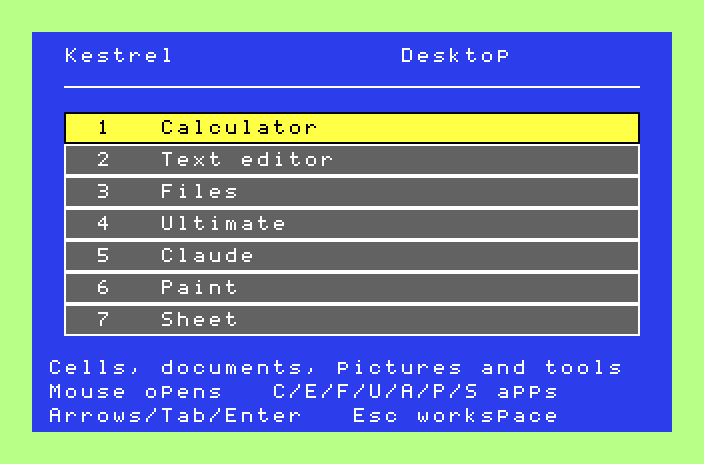</td>
<td>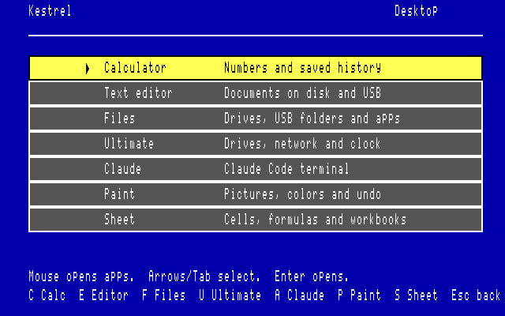</td>
</tr>
<tr><td align="center">Launcher, VIC-II (40 columns)</td><td align="center">Launcher, VDC (80 columns)</td></tr>
</table>

## What it is

- **A native C128 kernel.** It runs in C128 mode, manages both 64 KiB RAM
  banks through owner-checked handles (426 managed pages), loads apps and
  their modules from a checked manifest, and cleans up after them. See
  [NATIVE-KERNEL](docs/NATIVE-KERNEL.md) and [NATIVE-APPS](docs/NATIVE-APPS.md).
- **Two screens at once.** Apps draw a hires VIC-II bitmap. A shared VDC
  service mirrors it on the 80-column screen, with colour when the VDC has
  64 KiB ([NATIVE-VDC-SERVICE](docs/NATIVE-VDC-SERVICE.md)).
- **Expansion memory.** A 17xx REU backs screen snapshots and Editor
  documents, with main RAM as the fallback ([NATIVE-REU](docs/NATIVE-REU.md)).
- **Storage.** 1541/1571/1581 drives on IEC devices 8–30 (D64, D71, D81), and
  the Ultimate's USB storage through its command interface. Saves are closed,
  reopened and compared byte for byte before they are reported as done.
- **Input.** Keyboard throughout, and a 1351 mouse in port 1.
- **Two desktops.** The blue launcher, and GEMDESK, a TOS-style GEM desktop
  on Kestrel's own AES.

## The apps

Everything below is a screenshot of the real disk images running in VICE,
except where noted. Each app draws the same scene on both screens.

### Calculator

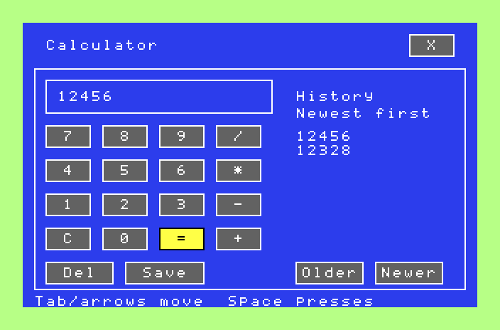

Keypad and keyboard entry, a history of 32 results kept in bank 1, and Save
to a file ([NATIVE-CALCULATOR](docs/NATIVE-CALCULATOR.md)).

### Text editor

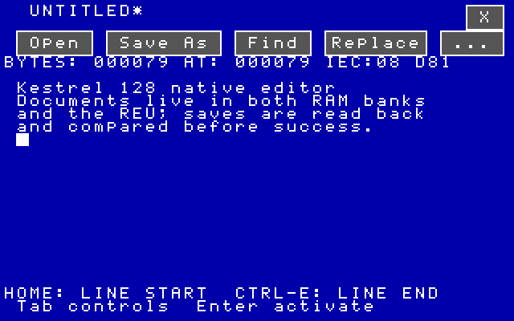

Documents across both RAM banks and the REU, including documents over 64 KiB.
It has Open and Save As on IEC or USB through a shared file picker,
Find/Replace, mouse and keyboard selection, Copy/Cut/Paste through a session
clipboard, a 16-step undo/redo, and Print (Ctrl-P) to a printer on IEC device
4, such as the Ultimate II+'s printer emulation. See
[NATIVE-EDITOR-GUI](docs/NATIVE-EDITOR-GUI.md), [NATIVE-EDITOR](docs/NATIVE-EDITOR.md)
and [NATIVE-HISTORY](docs/NATIVE-HISTORY.md).

### Files

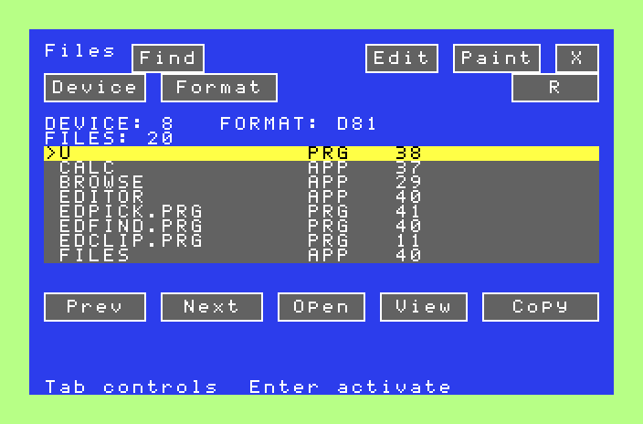

Browse IEC drives and USB folders, view bytes, and make, rename and delete
folders. It copies between IEC and USB with a byte-for-byte check, finds
names, and opens documents in Editor or Paint. See
[NATIVE-FILES-GUI](docs/NATIVE-FILES-GUI.md) and [NATIVE-BROWSER](docs/NATIVE-BROWSER.md).

### Sheet

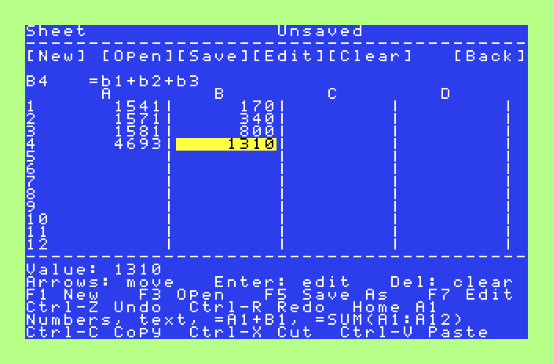

An 8×32 workbook with decimal formulas (up to six decimals, each step
rounded once), cell references, SUM/MIN/MAX/COUNT, undo/redo, the shared
clipboard, and verified Save As ([NATIVE-SHEET](docs/NATIVE-SHEET.md)). In the screenshot, A4 and B4 hold
`=a1+a2+a3` and `=b1+b2+b3`.

### Paint

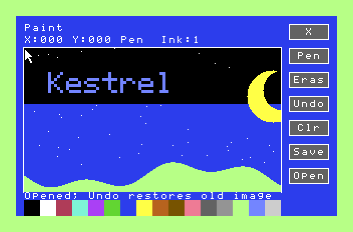

Pencil and eraser with mouse strokes or a keyboard brush, 16 inks, undo, and
checked picture files (UPNT) ([NATIVE-PAINT](docs/NATIVE-PAINT.md)). The
picture was generated by `tools/readme_screenshots.py`, written to the disk as
a UPNT file and opened from Files. Paint validated it and drew it.

### Ultimate

<table>
<tr>
<td>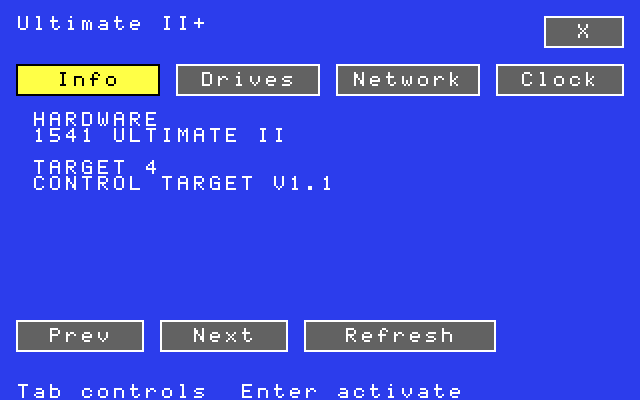</td>
<td>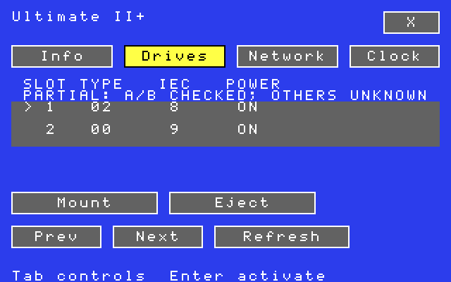</td>
</tr>
</table>

Hardware identification, drive inventory with image mount and eject,
network addresses and the cartridge clock, through the Ultimate II+ command
interface ([NATIVE-ULTIMATE-CONTROLS](docs/NATIVE-ULTIMATE-CONTROLS.md)).
VICE does not emulate that interface, so these two screenshots come from a
**real C128 with an Ultimate II+**. Each is the app's VIC bitmap and colour
cells, read through Kestrel's capture service and rendered with VICE's palette.
The mouse pointer (a sprite) is not part of that capture.

### Claude

<table>
<tr>
<td>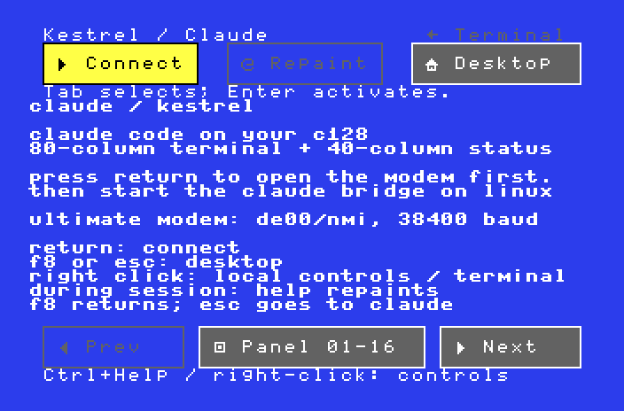</td>
<td>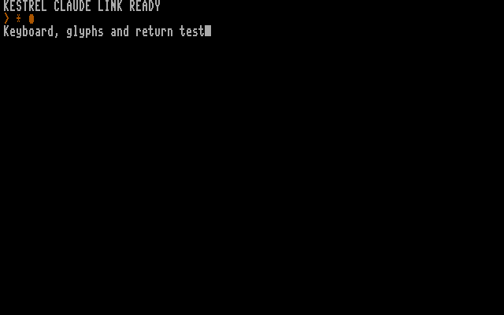</td>
</tr>
</table>

A Claude Code terminal. The C128 connects over the Ultimate's modem
emulation (a SwiftLink-compatible ACIA) to a bridge running on a Linux host.
The 80-column screen is the terminal; the 40-column screen keeps controls and
status ([apps/claude](apps/claude/README.md), [NATIVE-CLAUDE-GUI](docs/NATIVE-CLAUDE-GUI.md)).
In the right-hand screenshot, the bridge runs the repository's test session
(`tests/fixtures/claude-session.py`), not a live Claude login.

## GEMDESK, the GEM desktop

<table>
<tr>
<td>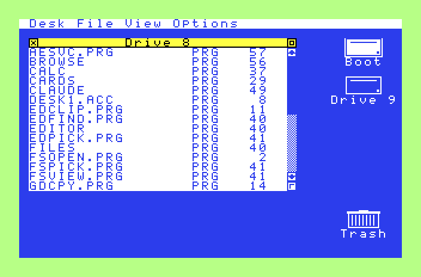</td>
<td>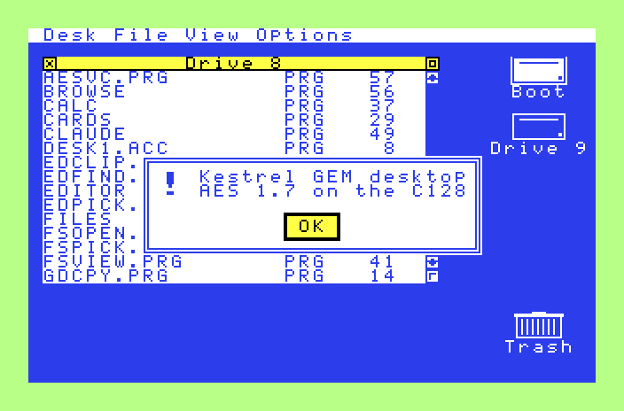</td>
</tr>
</table>

<table>
<tr>
<td>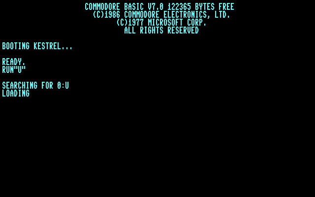</td>
<td>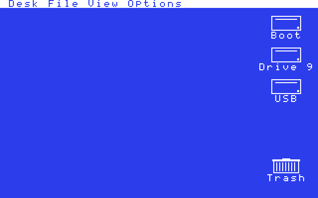</td>
</tr>
<tr><td align="center">File menu, VDC (80 columns)</td><td align="center">On a real C128: the USB icon appears when the Ultimate answers</td></tr>
</table>

A TOS-style desktop on Kestrel's native AES, which provides menus, windows,
alerts and forms. It has drive icons with Boot, Drive 9, USB and Trash. Drive
windows (up to four) sort by name, type or size. Rows are selected with a
click, Shift-click, Ctrl-A or a band dragged from below the entries, and
selected files are deleted, dropped on Trash, or dragged to another window
or drive icon to copy or move them between drives and USB storage (each copy
reopened and compared before a move deletes the original). It adds Show
Info with rename, Format, Preferences, and remembers the desktop across app
launches. Apps opened from GEMDESK return to it. See
[GEM-DESKTOP](docs/GEM-DESKTOP.md), [NATIVE-AES](docs/NATIVE-AES.md) and
[NATIVE-FORMS](docs/NATIVE-FORMS.md). The GEM disk also carries a VT52
terminal on the 80-column screen ([NATIVE-VT52](docs/NATIVE-VT52.md)).

## Building

You need Python 3, [64tass](https://sourceforge.net/projects/tass64/), VICE's
`c1541` and [cc65](https://cc65.github.io/) (`ca65`/`cl65`, for Sheet and the
Claude client).

```sh
python3 -B build-native-desktop.py
python3 -B build-native-graphics.py    # the graphics library some tests load
```

This writes to `target/native-desktop/`:

| Image | Boots into |
|---|---|
| `kestrel.d64` / `kestrel.d81` | The blue launcher and all seven apps (1541 / 1581) |
| `gem.d81` | GEMDESK, the same apps, the AES and VT52 |

## Running

**VICE:**

```sh
x128 -default -80col -8 target/native-desktop/kestrel.d81 -drive8true -drive8type 1581
```

Use `gem.d81` the same way for GEMDESK. Both screens are live; VICE shows one
window per display.

**A real C128:** mount the image on the Ultimate II+'s drive A (1581 mode for
a D81) and reset. The C128 boots from the disk's boot sector. An REU is
optional; a 1351-compatible mouse in port 1 is optional. See
[NATIVE-BOOT-MEDIA](docs/NATIVE-BOOT-MEDIA.md).

## Testing

The suites run the real 6502 code:

- **CPU suites** run app and kernel code in a 6502 simulator (py65):
  321 jobs.
- **VICE suites** boot the disk images in x128 and drive them with keyboard,
  mouse and serial input: 59 jobs.
- **Hardware checks** (`hw_*.py`) drive a real C128 through the Ultimate II+
  REST API and FTP server. Each records the drive state first, works on
  private uploads, and afterwards puts every drive's image and mode back,
  deletes its uploads and resets the C128 (`hw_session.py`). The checks
  refuse to start while either Ultimate DOS context holds an open file, and
  close one a check leaves open (`hw_dos_context.py`; an open file survives
  a C128 reset). `hw_ultimate_check.py --close-dos-context N` reports and
  closes one by hand. Give the Ultimate's address with `--host` or
  `KESTREL_ULTIMATE_HOST`.

```sh
python3 -m pip install -r tests/requirements.txt
python3 -B tests/sweep_native.py --group cpu  --jobs 4 --out /tmp/sweep-cpu
python3 -B tests/sweep_native.py --group vice --jobs 2 --out /tmp/sweep-vice
KESTREL_ULTIMATE_HOST=192.0.2.10 python3 -B hw_native_gem_check.py --report /tmp/gem.json
```

Records of each change, with the commands and results, are under
[`docs/validation/`](docs/validation/) (see its README for what was kept).

The screenshots in this README are regenerated by `tools/readme_screenshots.py`
(VICE). The real-hardware ones come from `hw_native_gem_check.py --screens DIR`.

## Status

Kestrel 128 is under active development. The
[implementation roadmap](docs/IMPLEMENTATION-ROADMAP.md) and the
[TOS parity table](docs/TOS-PARITY.md) list what is done and what is not.
Some of what is missing:

- Movable, overlapping app windows and switching between running apps.
- Typing a new name on a name conflict in GEMDESK copies (Replace, Keep
  both with a numbered name, Skip and Stop exist, and folders merge).
- Sheet number formats (decimals shown per cell).
- REU use beyond screen snapshots and Editor documents.

## Credits and license

Kestrel 128 is free software under the GNU General Public License, version 3
or later ([LICENSE](LICENSE)). It began as Scott Hutter's UltOS
([xlar54/uos-master](https://github.com/xlar54/uos-master)); the Claude
terminal comes from [claude-c128](https://github.com/marc-shade/claude-c128)
(MIT). [ACKNOWLEDGEMENTS](ACKNOWLEDGEMENTS.md) lists the rest.
